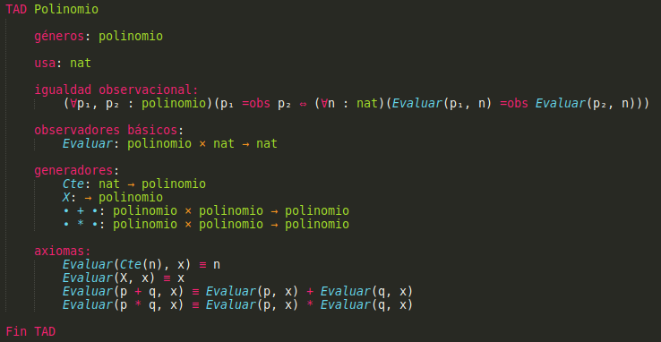
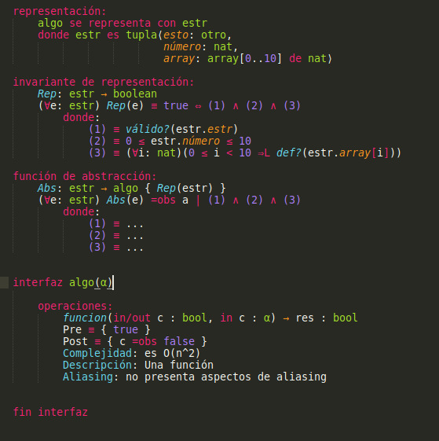

# Sintaxis para escribir TADs en Sublime Text

Un paquete de sublime text para escribir los TADs y sus aspectos de diseño.

## Instalación

1. Instalar [Sublime Text 3](https://www.sublimetext.com/3).
2. Descargar el archivo `Algo2-TADs.sublime-package`.
3. Ponerlo en la carpeta de Sublime `Installed Packages/`. Está un directorio arriba de la carpeta `Packages/` que se abre cuando usan el menú de Sublime: `Preferences > Browse Packages...`.

Si habían instalado el archivo `tad.tmLanguage` o `TAD.sublime-syntax` en `Packages/User/`, bórrenlo.

## Otros Paquetes

* **Símbolos**: Yo uso [`UnicodeMath`](https://github.com/mvoidex/UnicodeMath).
* **PDF**: Si lo abren en el browser con [`ExportHtml`](https://packagecontrol.io/packages/ExportHtml) pueden imprimirlo para pasarlo a PDF desde ahí (en general con `Control+P`).

## Visual Studio Code

Si alguien tiene ganas puede crear una extensión de vscode usando el archivo `tad.tmLanguage` en la carpeta `legacy` y siguiendo los pasos en este [thread de StackOverflow](https://stackoverflow.com/questions/30687783/create-custom-language-in-visual-studio-code).